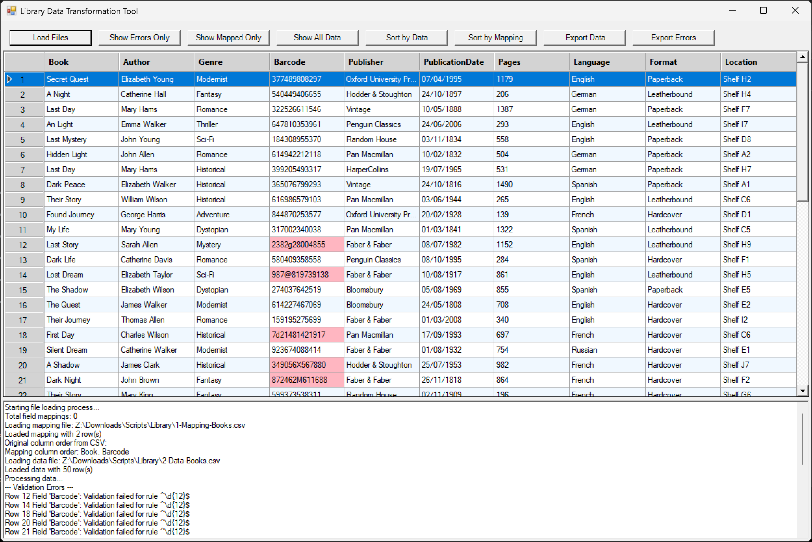
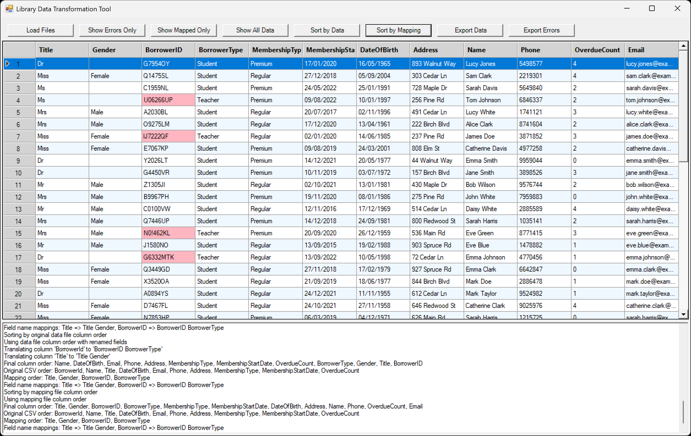
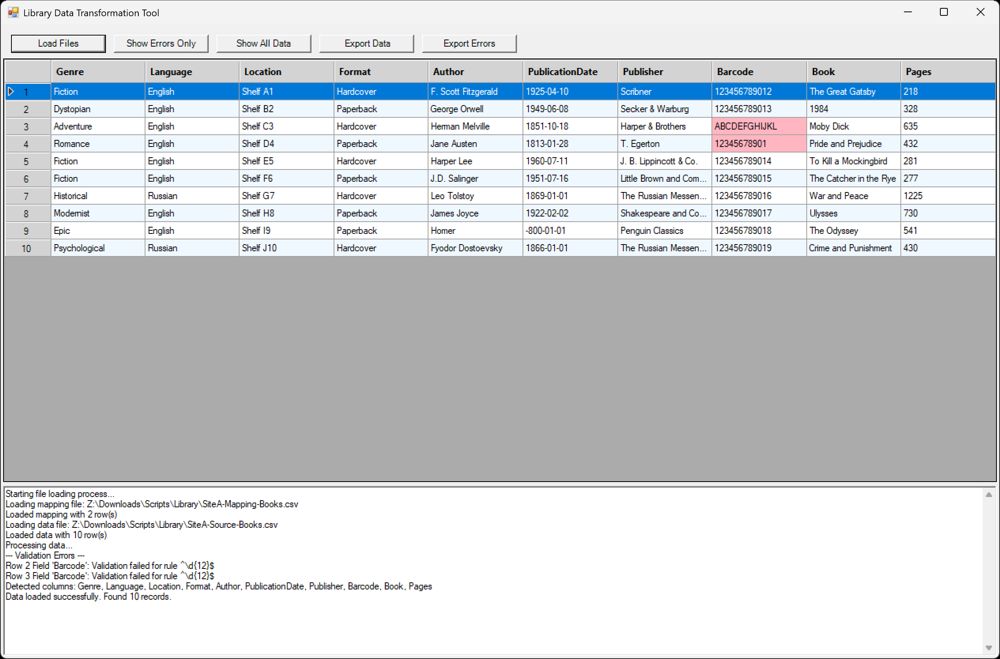

## Complete System Components

The Library Data Transformation Tool system consists of the following components:

1. **Main Transformation Tool** (Library-Data-Transformation-Tool.ps1)
   - The primary GUI application for transforming and validating data
   - Handles all mapping, validation, and transformation functionality

2. **Test Data Generation Scripts**
   - **0-Generate-Book-Data.PS1**: Creates sample book data for testing
   - **0-Generate-Borrower-Data.PS1**: Creates sample borrower data for testing

3. **Sample Mapping Files**
   - Create your own CSV files with mapping rules based on the examples provided

## Test Data Generation

The toolkit includes two PowerShell scripts to generate test data for functional and performance testing:

### 1. 0-Generate-Book-Data.PS1

This script generates realistic library book data with controlled error rates for testing validation rules.

```powershell
# Configurable variables
$NumberOfEntries = 50    # Default number of entries
$ExportFileName = "2-Data-Books.csv"    # Default export filename
$ErrorFields = @("Barcode")    # Fields where errors will be introduced
$ErrorRate = 15    # Default error rate percentage (15%)
$ErrorPlusMinus = 5    # Plus/minus randomness for error rate (5%)
```

**Features:**
- Generates book records with titles, authors, genres, barcodes, etc.
- Deliberately introduces errors in specified fields at a controlled rate
- Creates 12-digit barcodes that can be validated by regex
- Outputs data in CSV format ready for import into the transformation tool
- Reports statistics on generated data and error rates

**Sample Output Fields:**
- Title
- Author
- Genre
- Barcode (12-digit numeric)
- Publisher
- PublicationDate (dd/MM/yyyy format)
- Pages (numeric)
- Language
- Format
- Location

### 2. 0-Generate-Borrower-Data.PS1

This script generates borrower data with controlled error rates for testing validation and transformation rules.

```powershell
# Configurable variables
$NumberOfEntries = 50    # Default number of entries
$ExportFileName = "2-Data-Borrowers.csv"    # Default export filename
$ErrorFields = @("BorrowerId")    # Fields where errors will be introduced
$ErrorRate = 15    # Default error rate percentage (15%)
$ErrorPlusMinus = 5    # Plus/minus randomness for error rate (5%)
```

**Features:**
- Generates borrower records with IDs, names, contact information, etc.
- Creates IDs in the format `ANNNNAA` (letter, 4 digits, 2 letters)
- Deliberately introduces errors in specified fields at a controlled rate
- Includes title/salutation (Mr, Mrs, etc.) for GenderTransform function testing
- Outputs data in CSV format ready for import into the transformation tool

**Sample Output Fields:**
- BorrowerId (format matching `^[A-Za-z][0-9]{4}[A-Za-z]{2})
- Name
- Title (Mr, Mrs, Ms, etc.)
- DateOfBirth (dd/MM/yyyy format)
- Email
- Phone
- Address
- MembershipType
- MembershipStartDate (dd/MM/yyyy format)
- OverdueCount

### Usage for Test Data Generation

1. Adjust the configurable variables at the top of the scripts:
   - `$NumberOfEntries`: Number of records to generate
   - `$ExportFileName`: Output CSV filename
   - `$ErrorFields`: Fields where errors should be introduced
   - `$ErrorRate`: Targeted percentage of records with errors
   - `$ErrorPlusMinus`: Randomness range for error rate

2. Run the script in PowerShell:
   ```powershell
   .\0-Generate-Book-Data.PS1
   .\0-Generate-Borrower-Data.PS1
   ```

3. Use the generated CSV files for testing the transformation tool.

These scripts are valuable for:
- Testing validation rules with different error rates
- Performance testing with large data volumes
- Verifying transformation functions like GenderTransform and BorrowerTypeTransform
- Training and demonstrations# Library Data Transformation Tool

A PowerShell-based utility for transforming and validating CSV data according to mapping rules, with support for multiple field mappings and console minimization. Includes tools for test data generation.

### Application Interface




## Overview

This tool provides a graphical interface for:
- Loading mapping rules from a CSV file
- Loading source data from a CSV file
- Performing data validation against specified rules
- Transforming data fields based on custom functions
- Highlighting validation errors in a grid view
- Exporting processed data to CSV

## Features

- **Data Mapping**: Define source and target field names, mandatory fields, data types, and validation rules
- **Multiple Field Mappings**: Support for mapping a single source field to multiple target fields
- **Data Validation**: Validate data against regex patterns with visual error highlighting
- **Data Transformation**: Apply custom transformation functions to data fields
- **Visual Interface**: View data in a grid with alternating row colors, row numbers, and error highlighting
- **Console Minimization**: Automatically minimizes the PowerShell console window for a cleaner UI experience
- **Filtering**: 
  - Show only rows with validation errors
  - Show only mapped fields
- **Column Ordering**:
  - Sort by original data file column order
  - Sort by mapping file column order
- **Export**: Export processed data and error logs to CSV files
- **Detailed Logging**: Comprehensive logging of field mappings, transformations, and errors
- **Test Data Generation**: Scripts for generating sample book and borrower data with controlled error rates

## Requirements

- Windows PowerShell 5.1 or later
- .NET Framework 4.5 or later

## Usage

1. Run the script to open the graphical interface
2. Click "Load Files" to select your mapping and data files
3. View processed data in the grid (validation errors highlighted in pink)
4. Use "Show Errors Only" to filter to rows with validation issues
5. Use "Show Mapped Only" to display only fields specified in mapping
6. Use "Show All Data" to revert to showing all rows and fields
7. Use "Sort by Data" to arrange columns in original CSV order
8. Use "Sort by Mapping" to arrange columns in mapping file order
9. Export processed data with the "Export Data" button
10. Export error logs with the "Export Errors" button

## Mapping File Format

The mapping file should be a CSV with the following columns:

| Column | Description |
| ------ | ----------- |
| SourceField | Name of the field in the source data |
| NewField | Name to use in the output (leave empty to keep original name) |
| DataType | Data type for conversion (string, int, decimal, datetime) |
| Mandatory | Y/N - whether the field is required |
| Validation | Y/N - whether to validate the field |
| ValidationRule | Regex pattern for validation |
| Transformation | Y/N - whether to transform the field |
| TransformFunction | Name of the transformation function to apply | 

## Data Processing

The tool processes data through several steps:

### 1. Field Mapping
- Maps source fields to new field names if specified in the `NewField` column
- If `NewField` is empty, the original `SourceField` name is retained
- Example: "Title" field becomes "BookTitle" if specified in mapping
- Supports mapping a single source field to multiple target fields
- Example: "Name" field could be mapped to both "FirstName" and "LastName" with different transformations
- The tool preserves a map of field name changes for consistent column ordering
- Tracks and logs fields with multiple mappings for better transparency

### 2. Data Type Conversion
- Converts data values to the specified type in the `DataType` column
- Supported data types include:
  - **string**: Default type, no conversion performed
  - **int**: Converts text values to integers
    - Example: "123" → 123
    - Fails conversion if value contains non-numeric characters
  - **decimal**: Converts text values to decimal numbers
    - Example: "45.67" → 45.67
    - Supports decimal points according to current culture
    - Fails if value contains invalid characters
  - **datetime**: Converts text values to date/time objects
    - Example: "2023-10-15" → DateTime object
    - Uses current culture's date format by default
    - Fails if the date format is invalid
- Failed conversions are reported as validation errors
- When conversion fails, the original value is preserved

### 3. Mandatory Field Validation
- Checks if required fields (marked with `Mandatory` = "Y") are present
- Reports an error if a mandatory field is empty or null
- Example error: "Row 2 Field 'Title': Mandatory field missing (original value)"
- Also checks if values are empty after transformation with improved error messages
- Detects and reports completely missing mandatory fields in source data

### 4. Pattern Validation
- Validates data against regex patterns in the `ValidationRule` column
- Only performed when `Validation` = "Y"
- Validation succeeds if the value matches the pattern
- Example: Validating email addresses against pattern `^[\w\.-]+@[\w\.-]+\.\w+$`
- Validation errors are highlighted in pink in the grid

### 5. Transformation
- Applies custom transformation functions to fields
- Only performed when `Transformation` = "Y"
- Uses the function named in the `TransformFunction` column
- Example transformation: Converting "Mr" to "Male" with `GenderTransform` function
- Transformations can combine or modify values, change formats, etc.
- Logs the number of fields and records affected by transformations

### Processing Flow
1. Each record from the source data is processed individually
2. For each field in the record:
   - Apply mapping to determine output field name
   - Perform type conversion if specified
   - Check mandatory requirement
   - Apply validation if enabled
   - Apply transformation if enabled
3. Record validation errors for display and logging
4. Output processed data to the grid
5. Display error cells in pink
6. Log transformations applied to the data

### Column Ordering

The tool now supports two different column ordering options:

1. **Data File Order** (default): 
   - Maintains the original column order from the source CSV
   - Translates field names according to mapping
   - Preserves user's expected order of fields

2. **Mapping File Order**:
   - Orders columns according to the order they appear in the mapping file
   - Useful when a specific output order is required
   - Fields not in mapping appear at the end

### Error Highlighting

- Error cells are highlighted in pink in the grid
- Row numbers clearly show which rows contain errors
- Detailed error messages are displayed in the log
- Export all errors to CSV for documentation

### Examples

**Input CSV:**
```
Title,Author,Pages,PublishDate
The Great Gatsby,F. Scott Fitzgerald,180,04/10/1925
```

**Mapping CSV:**
```
SourceField,NewField,DataType,Mandatory,Validation,ValidationRule,Transformation,TransformFunction
Title,BookTitle,string,Y,Y,^.{1,100}$,N,
Author,AuthorName,string,Y,N,,N,
Pages,PageCount,int,N,Y,^\d+$,N,
PublishDate,PublicationDate,datetime,Y,Y,,,N,
```

**Processing Result:**
- "Title" → "BookTitle" (field mapping)
- "Pages" → 180 (converted from string to integer)
- "PublishDate" → DateTime object (converted to datetime type)
- Validates "Title" length is between 1-100 characters
- Validates "Pages" contains only digits
- All mandatory fields are checked for values
- A single field can be mapped to multiple target fields with different transformations
- The tool tracks and reports fields that have multiple mappings

The tool provides a complete audit trail of the processing through the log panel, showing which fields were transformed, which fields had multiple mappings, and any validation errors encountered. It also reports on generated fields created through transformations.

## Validation Rule Examples

The `ValidationRule` column in the mapping file accepts regular expression patterns. Here are common validation patterns for UK formats:

| Data Type              | Regex Pattern                                                                                  | Example                     |
|------------------------|------------------------------------------------------------------------------------------------|-----------------------------|
| Email                  | `^[\w\.-]+@[\w\.-]+\.\w+$`                                                                    | `john.doe@example.co.uk`    |
| UK Phone               | `^(?:(?:\+44\s?|0)(?:1\d{8,9}|[23]\d{9}|7(?:[1345789]\d{8}|624\d{6})))$`                      | `+44 7123 456789`          |
| Date (DD/MM/YYYY)      | `^(0[1-9]|[12][0-9]|3[01])\/(0[1-9]|1[0-2])\/\d{4}$`                                         | `25/12/2023`               |
| UK National Insurance  | `^[A-CEGHJ-PR-TW-Z]{1}[A-CEGHJ-NPR-TW-Z]{1}[0-9]{6}[A-D]{1}$`                                | `AB123456C`                |
| UK Company Number      | `^(SC\|NI\|AC\|FC\|IC\|IP\|LP\|NA\|NL\|NO\|NP\|NR\|NZ\|OC\|R\|RC\|SA\|SF\|SI\|SL\|SO\|SP)\d{6}$\|^\d{8}$` | `SC123456` or `12345678`   |
| UK Bank Sort Code      | `^\d{2}-\d{2}-\d{2}$`                                                                        | `12-34-56`                 |
| UK Bank Account        | `^\d{8}$`                                                                                    | `12345678`                 |
| Numeric only           | `^\d+$`                                                                                      | `12345`                    |
| Price (£)              | `^£\d+\.\d{2}$`                                                                              | `£99.95`                   |
| ISBN                   | `^(?:ISBN(?:-13)?:?\s)?(?=[0-9X]{10}$\|(?=(?:[0-9]+[-\s]){3})[-\s0-9X]{13}$)`                 | `ISBN-13: 978-0-123456-47-2` |
| URL                    | `^(https?:\/\/)?([\da-z\.-]+)\.([a-z\.]{2,6})([\/\w \.-]*)*\/?$`                              | `https://example.com/path`  |
| Name                   | `^[a-zA-Z\s'-]+$`                                                                            | `Mary-Jane O'Brien`        |
| UK Driving License     | `^[A-Z]{5}\d{6}[A-Z]{2}\d[A-Z]{2}$`                                                          | `SMITH123456AB7CD`         |

### Additional Regex Use Cases

| Validation Purpose | Regex Pattern | Description |
| ------------------ | ------------- | ----------- |
| Alpha-numeric | `^[a-zA-Z0-9]+$` | Letters and numbers only |
| Fixed length | `^.{10}$` | Exactly 10 characters |
| Min-max length | `^.{8,16}$` | Between 8-16 characters |
| Integer range | `^([1-9]|[1-9][0-9]|100)$` | Numbers 1-100 |
| Time (24-hour) | `^([01]?[0-9]|2[0-3]):[0-5][0-9]$` | Format: 14:30 |
| Hex color | `^#([A-Fa-f0-9]{6}|[A-Fa-f0-9]{3})$` | Format: #FF0000 or #F00 |
| IP Address | `^\d{1,3}\.\d{1,3}\.\d{1,3}\.\d{1,3}$` | Format: 192.168.1.1 |
| UK Passport Number | `^[0-9]{9}$` | UK passport number (9 digits) |
| UK NHS Number | `^\d{3}[ -]?\d{3}[ -]?\d{4}$` | Format: 123 456 7890 |

## Extending Transformations

You can add custom transformation functions by editing the script. Each function should:

1. Accept a single input value
2. Return the transformed value
3. Be registered in the `$global:TransformFunctions` hashtable

Example transformation function:

```powershell
# Transformation functions
function GenderTransform($value) {
    if ($value -match "Mr") { return "Male" }
    elseif ($value -match "Mrs" -or $value -match "Miss") { return "Female" }
    else { return "" }
}

function BorrowerTypeTransform($value) {
    if ($value -match "^[A-Za-z][0-9]{4}[A-Za-z]{2}$") { 
        return "Student" 
    } else { 
        return "Teacher" 
    }
}

$global:TransformFunctions = @{}
$global:TransformFunctions["GenderTransform"] = ${function:GenderTransform}
$global:TransformFunctions["BorrowerTypeTransform"] = ${function:BorrowerTypeTransform}
```

## Extending Transformations

You can add custom transformation functions by editing the script. Each function should:

1. Accept a single input value
2. Return the transformed value
3. Be registered in the `$global:TransformFunctions` hashtable

The recommended way to register transformation functions:

```powershell
function CustomTransform($value) {
    # Your transformation logic here
    return $transformedValue
}

# Register the function
$global:TransformFunctions["CustomTransform"] = ${function:CustomTransform}
```

## Implementing Complex Validation

For more complex validation that regex alone can't handle, you can create custom validation functions similar to transformation functions:

```powershell
function ValidateUKPostcode($value) {
    # First standardize by removing spaces and converting to uppercase
    $value = $value.ToUpper().Replace(" ", "")
    
    # Basic format check using regex
    if (-not ($value -match '^[A-Z]{1,2}[0-9R][0-9A-Z]?[0-9][ABD-HJLNP-UW-Z]{2}

## Validation Best Practices

1. **Start simple**: Begin with basic validations and add complexity as needed
2. **Test thoroughly**: Create test data that intentionally violates validation rules
3. **Layer validation**: Use regex for format, custom functions for complex logic
4. **Balance strictness**: Overly strict validation may reject valid data
5. **Use appropriate error handling**: Choose between warning, error, and log based on data importance
6. **Document patterns**: Keep a record of regex patterns and their purposes
7. **Consider data cleansing**: Sometimes it's better to transform/cleanse than reject

## Test Data Generation

The toolkit includes two PowerShell scripts to generate test data for functional and performance testing:

### 1. 0-Generate-Book-Data.PS1

This script generates realistic library book data with controlled error rates for testing validation rules.

```powershell
# Configurable variables
$NumberOfEntries = 50    # Default number of entries
$ExportFileName = "2-Data-Books.csv"    # Default export filename
$ErrorFields = @("Barcode")    # Fields where errors will be introduced
$ErrorRate = 15    # Default error rate percentage (15%)
$ErrorPlusMinus = 5    # Plus/minus randomness for error rate (5%)
```

**Features:**
- Generates book records with titles, authors, genres, barcodes, etc.
- Deliberately introduces errors in specified fields at a controlled rate
- Creates 12-digit barcodes that can be validated by regex
- Outputs data in CSV format ready for import into the transformation tool
- Reports statistics on generated data and error rates

**Sample Output Fields:**
- Title
- Author
- Genre
- Barcode (12-digit numeric)
- Publisher
- PublicationDate (dd/MM/yyyy format)
- Pages (numeric)
- Language
- Format
- Location

### 2. 0-Generate-Borrower-Data.PS1

This script generates borrower data with controlled error rates for testing validation and transformation rules.

```powershell
# Configurable variables
$NumberOfEntries = 50    # Default number of entries
$ExportFileName = "2-Data-Borrowers.csv"    # Default export filename
$ErrorFields = @("BorrowerId")    # Fields where errors will be introduced
$ErrorRate = 15    # Default error rate percentage (15%)
$ErrorPlusMinus = 5    # Plus/minus randomness for error rate (5%)
```

**Features:**
- Generates borrower records with IDs, names, contact information, etc.
- Creates IDs in the format `ANNNNAA` (letter, 4 digits, 2 letters)
- Deliberately introduces errors in specified fields at a controlled rate
- Includes title/salutation (Mr, Mrs, etc.) for GenderTransform function testing
- Outputs data in CSV format ready for import into the transformation tool

**Sample Output Fields:**
- BorrowerId (format matching `^[A-Za-z][0-9]{4}[A-Za-z]{2}# Library Data Transformation Tool

A PowerShell-based utility for transforming and validating CSV data according to mapping rules, with support for multiple field mappings and console minimization. Includes tools for test data generation.

### Application Interface


## Overview

This tool provides a graphical interface for:
- Loading mapping rules from a CSV file
- Loading source data from a CSV file
- Performing data validation against specified rules
- Transforming data fields based on custom functions
- Highlighting validation errors in a grid view
- Exporting processed data to CSV

## Features

- **Data Mapping**: Define source and target field names, mandatory fields, data types, and validation rules
- **Multiple Field Mappings**: Support for mapping a single source field to multiple target fields
- **Data Validation**: Validate data against regex patterns with visual error highlighting
- **Data Transformation**: Apply custom transformation functions to data fields
- **Visual Interface**: View data in a grid with alternating row colors, row numbers, and error highlighting
- **Console Minimization**: Automatically minimizes the PowerShell console window for a cleaner UI experience
- **Filtering**: 
  - Show only rows with validation errors
  - Show only mapped fields
- **Column Ordering**:
  - Sort by original data file column order
  - Sort by mapping file column order
- **Export**: Export processed data and error logs to CSV files
- **Detailed Logging**: Comprehensive logging of field mappings, transformations, and errors
- **Test Data Generation**: Scripts for generating sample book and borrower data with controlled error rates

## Requirements

- Windows PowerShell 5.1 or later
- .NET Framework 4.5 or later

## Usage

1. Run the script to open the graphical interface
2. Click "Load Files" to select your mapping and data files
3. View processed data in the grid (validation errors highlighted in pink)
4. Use "Show Errors Only" to filter to rows with validation issues
5. Use "Show Mapped Only" to display only fields specified in mapping
6. Use "Show All Data" to revert to showing all rows and fields
7. Use "Sort by Data" to arrange columns in original CSV order
8. Use "Sort by Mapping" to arrange columns in mapping file order
9. Export processed data with the "Export Data" button
10. Export error logs with the "Export Errors" button

## Mapping File Format

The mapping file should be a CSV with the following columns:

| Column | Description |
| ------ | ----------- |
| SourceField | Name of the field in the source data |
| NewField | Name to use in the output (leave empty to keep original name) |
| DataType | Data type for conversion (string, int, decimal, datetime) |
| Mandatory | Y/N - whether the field is required |
| Validation | Y/N - whether to validate the field |
| ValidationRule | Regex pattern for validation |
| Transformation | Y/N - whether to transform the field |
| TransformFunction | Name of the transformation function to apply | 

## Data Processing

The tool processes data through several steps:

### 1. Field Mapping
- Maps source fields to new field names if specified in the `NewField` column
- If `NewField` is empty, the original `SourceField` name is retained
- Example: "Title" field becomes "BookTitle" if specified in mapping
- Supports mapping a single source field to multiple target fields
- Example: "Name" field could be mapped to both "FirstName" and "LastName" with different transformations
- The tool preserves a map of field name changes for consistent column ordering
- Tracks and logs fields with multiple mappings for better transparency

### 2. Data Type Conversion
- Converts data values to the specified type in the `DataType` column
- Supported data types include:
  - **string**: Default type, no conversion performed
  - **int**: Converts text values to integers
    - Example: "123" → 123
    - Fails conversion if value contains non-numeric characters
  - **decimal**: Converts text values to decimal numbers
    - Example: "45.67" → 45.67
    - Supports decimal points according to current culture
    - Fails if value contains invalid characters
  - **datetime**: Converts text values to date/time objects
    - Example: "2023-10-15" → DateTime object
    - Uses current culture's date format by default
    - Fails if the date format is invalid
- Failed conversions are reported as validation errors
- When conversion fails, the original value is preserved

### 3. Mandatory Field Validation
- Checks if required fields (marked with `Mandatory` = "Y") are present
- Reports an error if a mandatory field is empty or null
- Example error: "Row 2 Field 'Title': Mandatory field missing (original value)"
- Also checks if values are empty after transformation with improved error messages
- Detects and reports completely missing mandatory fields in source data

### 4. Pattern Validation
- Validates data against regex patterns in the `ValidationRule` column
- Only performed when `Validation` = "Y"
- Validation succeeds if the value matches the pattern
- Example: Validating email addresses against pattern `^[\w\.-]+@[\w\.-]+\.\w+$`
- Validation errors are highlighted in pink in the grid

### 5. Transformation
- Applies custom transformation functions to fields
- Only performed when `Transformation` = "Y"
- Uses the function named in the `TransformFunction` column
- Example transformation: Converting "Mr" to "Male" with `GenderTransform` function
- Transformations can combine or modify values, change formats, etc.
- Logs the number of fields and records affected by transformations

### Processing Flow
1. Each record from the source data is processed individually
2. For each field in the record:
   - Apply mapping to determine output field name
   - Perform type conversion if specified
   - Check mandatory requirement
   - Apply validation if enabled
   - Apply transformation if enabled
3. Record validation errors for display and logging
4. Output processed data to the grid
5. Display error cells in pink
6. Log transformations applied to the data

### Column Ordering

The tool now supports two different column ordering options:

1. **Data File Order** (default): 
   - Maintains the original column order from the source CSV
   - Translates field names according to mapping
   - Preserves user's expected order of fields

2. **Mapping File Order**:
   - Orders columns according to the order they appear in the mapping file
   - Useful when a specific output order is required
   - Fields not in mapping appear at the end

### Error Highlighting

- Error cells are highlighted in pink in the grid
- Row numbers clearly show which rows contain errors
- Detailed error messages are displayed in the log
- Export all errors to CSV for documentation

### Examples

**Input CSV:**
```
Title,Author,Pages,PublishDate
The Great Gatsby,F. Scott Fitzgerald,180,04/10/1925
```

**Mapping CSV:**
```
SourceField,NewField,DataType,Mandatory,Validation,ValidationRule,Transformation,TransformFunction
Title,BookTitle,string,Y,Y,^.{1,100}$,N,
Author,AuthorName,string,Y,N,,N,
Pages,PageCount,int,N,Y,^\d+$,N,
PublishDate,PublicationDate,datetime,Y,Y,,,N,
```

**Processing Result:**
- "Title" → "BookTitle" (field mapping)
- "Pages" → 180 (converted from string to integer)
- "PublishDate" → DateTime object (converted to datetime type)
- Validates "Title" length is between 1-100 characters
- Validates "Pages" contains only digits
- All mandatory fields are checked for values
- A single field can be mapped to multiple target fields with different transformations
- The tool tracks and reports fields that have multiple mappings

The tool provides a complete audit trail of the processing through the log panel, showing which fields were transformed, which fields had multiple mappings, and any validation errors encountered. It also reports on generated fields created through transformations.

## Validation Rule Examples

The `ValidationRule` column in the mapping file accepts regular expression patterns. Here are common validation patterns for UK formats:

| Data Type              | Regex Pattern                                                                                  | Example                     |
|------------------------|------------------------------------------------------------------------------------------------|-----------------------------|
| Email                  | `^[\w\.-]+@[\w\.-]+\.\w+$`                                                                    | `john.doe@example.co.uk`    |
| UK Phone               | `^(?:(?:\+44\s?|0)(?:1\d{8,9}|[23]\d{9}|7(?:[1345789]\d{8}|624\d{6})))$`                      | `+44 7123 456789`          |
| Date (DD/MM/YYYY)      | `^(0[1-9]|[12][0-9]|3[01])\/(0[1-9]|1[0-2])\/\d{4}$`                                         | `25/12/2023`               |
| UK National Insurance  | `^[A-CEGHJ-PR-TW-Z]{1}[A-CEGHJ-NPR-TW-Z]{1}[0-9]{6}[A-D]{1}$`                                | `AB123456C`                |
| UK Company Number      | `^(SC\|NI\|AC\|FC\|IC\|IP\|LP\|NA\|NL\|NO\|NP\|NR\|NZ\|OC\|R\|RC\|SA\|SF\|SI\|SL\|SO\|SP)\d{6}$\|^\d{8}$` | `SC123456` or `12345678`   |
| UK Bank Sort Code      | `^\d{2}-\d{2}-\d{2}$`                                                                        | `12-34-56`                 |
| UK Bank Account        | `^\d{8}$`                                                                                    | `12345678`                 |
| Numeric only           | `^\d+$`                                                                                      | `12345`                    |
| Price (£)              | `^£\d+\.\d{2}$`                                                                              | `£99.95`                   |
| ISBN                   | `^(?:ISBN(?:-13)?:?\s)?(?=[0-9X]{10}$\|(?=(?:[0-9]+[-\s]){3})[-\s0-9X]{13}$)`                 | `ISBN-13: 978-0-123456-47-2` |
| URL                    | `^(https?:\/\/)?([\da-z\.-]+)\.([a-z\.]{2,6})([\/\w \.-]*)*\/?$`                              | `https://example.com/path`  |
| Name                   | `^[a-zA-Z\s'-]+$`                                                                            | `Mary-Jane O'Brien`        |
| UK Driving License     | `^[A-Z]{5}\d{6}[A-Z]{2}\d[A-Z]{2}$`                                                          | `SMITH123456AB7CD`         |

### Additional Regex Use Cases

| Validation Purpose | Regex Pattern | Description |
| ------------------ | ------------- | ----------- |
| Alpha-numeric | `^[a-zA-Z0-9]+$` | Letters and numbers only |
| Fixed length | `^.{10}$` | Exactly 10 characters |
| Min-max length | `^.{8,16}$` | Between 8-16 characters |
| Integer range | `^([1-9]|[1-9][0-9]|100)$` | Numbers 1-100 |
| Time (24-hour) | `^([01]?[0-9]|2[0-3]):[0-5][0-9]$` | Format: 14:30 |
| Hex color | `^#([A-Fa-f0-9]{6}|[A-Fa-f0-9]{3})$` | Format: #FF0000 or #F00 |
| IP Address | `^\d{1,3}\.\d{1,3}\.\d{1,3}\.\d{1,3}$` | Format: 192.168.1.1 |
| UK Passport Number | `^[0-9]{9}$` | UK passport number (9 digits) |
| UK NHS Number | `^\d{3}[ -]?\d{3}[ -]?\d{4}$` | Format: 123 456 7890 |

## Extending Transformations

You can add custom transformation functions by editing the script. Each function should:

1. Accept a single input value
2. Return the transformed value
3. Be registered in the `$global:TransformFunctions` hashtable

Example transformation function:

```powershell
# Transformation functions
function GenderTransform($value) {
    if ($value -match "Mr") { return "Male" }
    elseif ($value -match "Mrs" -or $value -match "Miss") { return "Female" }
    else { return "" }
}

function BorrowerTypeTransform($value) {
    if ($value -match "^[A-Za-z][0-9]{4}[A-Za-z]{2}$") { 
        return "Student" 
    } else { 
        return "Teacher" 
    }
}

$global:TransformFunctions = @{}
$global:TransformFunctions["GenderTransform"] = ${function:GenderTransform}
$global:TransformFunctions["BorrowerTypeTransform"] = ${function:BorrowerTypeTransform}
```

## Extending Transformations

You can add custom transformation functions by editing the script. Each function should:

1. Accept a single input value
2. Return the transformed value
3. Be registered in the `$global:TransformFunctions` hashtable

The recommended way to register transformation functions:

```powershell
function CustomTransform($value) {
    # Your transformation logic here
    return $transformedValue
}

# Register the function
$global:TransformFunctions["CustomTransform"] = ${function:CustomTransform}
```

## Implementing Complex Validation

For more complex validation that regex alone can't handle, you can create custom validation functions similar to transformation functions:

```powershell
function ValidateUKPostcode($value) {
    # First standardize by removing spaces and converting to uppercase
    $value = $value.ToUpper().Replace(" ", "")
    
    # Basic format check using regex
    if (-not ($value -match '^[A-Z]{1,2}[0-9R][0-9A-Z]?[0-9][ABD-HJLNP-UW-Z]{2}

## Validation Best Practices

1. **Start simple**: Begin with basic validations and add complexity as needed
2. **Test thoroughly**: Create test data that intentionally violates validation rules
3. **Layer validation**: Use regex for format, custom functions for complex logic
4. **Balance strictness**: Overly strict validation may reject valid data
5. **Use appropriate error handling**: Choose between warning, error, and log based on data importance
6. **Document patterns**: Keep a record of regex patterns and their purposes
7. **Consider data cleansing**: Sometimes it's better to transform/cleanse than reject

)
- Name
- Title (Mr, Mrs, Ms, etc.)
- DateOfBirth (dd/MM/yyyy format)
- Email
- Phone
- Address
- MembershipType
- MembershipStartDate (dd/MM/yyyy format)
- OverdueCount

### Usage for Test Data Generation

1. Adjust the configurable variables at the top of the scripts:
   - `$NumberOfEntries`: Number of records to generate
   - `$ExportFileName`: Output CSV filename
   - `$ErrorFields`: Fields where errors should be introduced
   - `$ErrorRate`: Targeted percentage of records with errors
   - `$ErrorPlusMinus`: Randomness range for error rate

2. Run the script in PowerShell:
   ```powershell
   .\0-Generate-Book-Data.PS1
   .\0-Generate-Borrower-Data.PS1
   ```

3. Use the generated CSV files for testing the transformation tool.

These scripts are valuable for:
- Testing validation rules with different error rates
- Performance testing with large data volumes
- Verifying transformation functions like GenderTransform and BorrowerTypeTransform
- Training and demonstrations

## Implementation Details

The tool is built using:
- PowerShell scripting language
- Windows Forms for the GUI
- .NET Framework classes for data manipulation
- Regular expressions for validation
- P/Invoke for console window management

The main components are:
- Form layout with resizable panels
- DataGridView for data display with row numbers
- Support for row and column selection
- Alternating row colors and error cell highlighting
- Comprehensive logging system
- CSV parsing with support for quoted fields

## Example Mapping Scenarios

### Library Book Catalog:
```csv
SourceField,NewField,DataType,Mandatory,Validation,ValidationRule,Transformation,TransformFunction
Title,BookTitle,string,Y,Y,^.{1,100}$,N,
Author,AuthorName,string,Y,N,,N,
ISBN,,string,Y,Y,^(?:ISBN(?:-13)?:?\s)?(?=[0-9X]{10}$|(?=(?:[0-9]+[-\s]){3})[-\s0-9X]{13}$),N,
PublishedYear,,int,Y,Y,^(19|20)\d{2}$,N,
PageCount,,int,N,Y,^\d{1,4}$,N,
Publisher,,string,Y,N,,N,
```

### Library Borrower Records:
```csv
SourceField,NewField,DataType,Mandatory,Validation,ValidationRule,Transformation,TransformFunction
BorrowerID,,string,Y,Y,^[A-Z][0-9]{4}[A-Z]{2}$|^T[0-9]{5}$,Y,BorrowerTypeTransform
BorrowerID,BorrowerType,string,N,N,,Y,BorrowerTypeTransform
Name,FirstName,string,Y,Y,^[A-Za-z\-']{2,30}$,Y,ExtractFirstName
Name,LastName,string,Y,Y,^[A-Za-z\-']{2,30}$,Y,ExtractLastName
Title,,string,N,N,,Y,GenderTransform
Title,Gender,string,N,N,,Y,GenderTransform
EmailAddress,,string,Y,Y,^[\w\.-]+@[\w\.-]+\.\w+$,N,
```

Note how in the Borrower Records example:
- `BorrowerID` is mapped twice (once as is, once to extract a type)
- `Name` is mapped to both `FirstName` and `LastName` with different transformations
- `Title` is both kept as-is and transformed to `Gender`)) {
        return $false
    }
    
    # Additional validation logic
    # For example, certain letter combinations are not used in the first position
    $invalidFirstLetters = @("QV", "X")
    $firstPart = if ($value[0..1] -join "" -match "^[A-Z]{2}$") { $value[0..1] -join "" } else { $value[0] }
    
    if ($invalidFirstLetters -contains $firstPart) {
        return $false
    }
    
    return $true
}

# Register the validation function
$global:ValidationFunctions = @{}
$global:ValidationFunctions["ValidateUKPostcode"] = ${function:ValidateUKPostcode}
```

Then in your mapping file:

```csv
SourceField,NewField,DataType,Mandatory,Validation,ValidationRule,ErrorHandling,Transformation,TransformFunction,ValidationFunction
Postcode,,string,Y,Y,,Error,N,,ValidateUKPostcode
```

## User Interface Improvements

The latest version includes several UI enhancements:

- **Clear layout**: Improved organization with proper panel placement
- **Row numbers**: Easy identification of data rows in the grid
- **Alternating row colors**: Better visual separation of rows
- **Error highlighting**: Clear visual indication of validation issues
- **Column headers**: Improved styling and click behavior for selection
- **Resizable panels**: Adjust data and log panel sizes as needed
- **Better error handling**: Graceful handling of display errors

## Logging

The tool provides detailed logging of:
- Loaded mapping and data files
- Field name translations 
- Original column orders from both data and mapping
- Validation errors with specific details
- Transformation summaries including affected fields and records
- Row and column counts
- Error details and locations

## User Interface Improvements

The latest version includes several UI enhancements:

- **Clear layout**: Improved organization with proper panel placement
- **Row numbers**: Easy identification of data rows in the grid
- **Alternating row colors**: Better visual separation of rows
- **Error highlighting**: Clear visual indication of validation issues
- **Column headers**: Improved styling and click behavior for selection
- **Resizable panels**: Adjust data and log panel sizes as needed
- **Better error handling**: Graceful handling of display errors

## Logging

The tool provides detailed logging of:
- Loaded mapping and data files
- Field name translations 
- Original column orders from both data and mapping
- Validation errors with specific details
- Transformation summaries including affected fields and records
- Row and column counts
- Error details and locations

## Implementation Details

The tool is built using:
- PowerShell scripting language
- Windows Forms for the GUI
- .NET Framework classes for data manipulation
- Regular expressions for validation
- P/Invoke for console window management

The main components are:
- Form layout with resizable panels
- DataGridView for data display with row numbers
- Support for row and column selection
- Alternating row colors and error cell highlighting
- Comprehensive logging system
- CSV parsing with support for quoted fields

## Special Features

### Multi-Field Mapping

The tool supports mapping a single source field to multiple target fields with different processing rules:

```csv
SourceField,NewField,DataType,Mandatory,Validation,ValidationRule,Transformation,TransformFunction
CustomerName,FirstName,string,Y,Y,^[A-Z][a-z]+$,Y,ExtractFirstName
CustomerName,LastName,string,Y,Y,^[A-Z][a-z]+$,Y,ExtractLastName
```

This allows:
- Splitting a field into multiple components
- Creating different views of the same data
- Applying different validation rules to each target field
- Transforming the same source data in different ways

### Field Generation Detection

The tool now tracks and reports on:
- Fields that have been transformed
- New fields that were generated through transformation
- The number of records affected by transformations
- Source fields with multiple mappings

### Console Window Management

The tool automatically minimizes the PowerShell console window when launched to provide a cleaner user interface experience. This is accomplished through P/Invoke calls to the Windows API.
